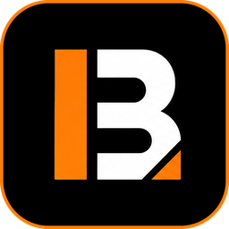

<div align="center">

<picture>
  <source media="(prefers-color-scheme: dark)" srcset="assets/brand/logo-dark.png">
  
</picture>

**Markets, minus the gatekeeping.**

A local-first, open-source market research and learning terminal for crypto and stocks.

_Educational information only — not financial advice._

[](https://github.com/KleivinX/Brew-Terminal/actions/workflows/ci.yml)
[](LICENSE)
[](#-getting-started)
[](https://tauri.app)

</div>

---

## ☕ What this is

Brew Terminal is a research and literacy tool that happens to look like a terminal. It makes
market data easier to read and financial language easier to learn, without pretending to be a
trading platform.

- **Local-first and account-free.** No sign-up, no server, no cloud sync. Your watchlists, notes and preferences live in a SQLite file on your computer.
- **No telemetry.** The app makes no request you did not cause.
- **Honest about its data.** Every number shows which provider it came from and how old it is.
- **Optional AI, off by default.** Bring a local model or your own API key, or use none at all.
- **You see what leaves.** Before anything is sent to a model you get an itemised list of exactly what goes with it, and every send is recorded in a local log you can read and clear.
- **Learn works offline.** A 50-term glossary and five learning paths ship with the app; no request is made to read any of it.
- **Your data is portable.** An encrypted `.brewprofile` moves your watchlists, notes, progress and settings to another machine. It contains no API keys.
- **Cross-platform.** macOS, Windows and Linux, built to stay responsive on a 2016 Intel MacBook.

## 🚫 What this is not

Not a broker. Not a portfolio tracker. Not a financial adviser. It will not tell you what to
buy, when to sell, where a price is going, or whether something is a good investment. Those are
not missing features — they are deliberate exclusions, documented in
[`docs/PRODUCT_SCOPE_V0_1.md`](docs/PRODUCT_SCOPE_V0_1.md).

There is no sentiment score, no "trending", no scam score and no legitimacy verdict anywhere in
the app. Anything that aggregates opinion into a number is a judgement, and this project has no
basis for one.

## Status

**v0.1.0 — feature-complete, not yet released.** Everything described here is built and covered
by tests. What that does not mean is "proven in the wild":

- **No AI request has been made against a live endpoint.** The request path is covered by unit tests, a guardrail suite and a browser harness — not by a real answer from a real model.
- **No live community provider is wired in.** The pipeline is complete and opt-in, but the only adapter that ships is a fixture one, because no discussion platform's terms have been read.
- **The app is unsigned.** A locally built `.dmg` opens fine; a downloaded one is blocked by Gatekeeper until you right-click → Open.
- **Guardrails reduce risk; they do not eliminate it.** You choose the model, and your model may ignore its instructions. The app shows its answers unedited and flags advice-shaped language so you can see when that happens, rather than claiming it cannot.

Crypto prices and history come from **CoinGecko** and are real. Equities need a free **Finnhub**
key, added in Settings → Data providers; until then the Stocks tab says so rather than showing
anything. Development builds also enable a fixture provider so the UI can be worked on offline —
anything it serves is labelled "Mock data" in the panel and in the status bar.

## ⬇️ Download

Installers for all three platforms are attached to each
[release](https://github.com/KleivinX/Brew-Terminal/releases): a universal `.dmg` for macOS
(Intel and Apple Silicon), `.msi` or `.exe` for Windows, and `.AppImage` or `.deb` for Linux.

The app is **not code-signed**, so the first launch needs one extra step:

- **macOS** — right-click the app and choose **Open**, then **Open** again. Double-clicking will not offer the option.
- **Windows** — SmartScreen shows "Windows protected your PC". Click **More info** → **Run anyway**.
- **Linux** — `chmod +x` the AppImage before running it.

That warning is expected. Signing needs a paid Apple Developer ID and a Windows code-signing
certificate; until those exist, every unsigned build behaves this way.

## 🚀 Getting started

Requires [Node.js](https://nodejs.org) 20.19+ and a [Rust toolchain](https://rustup.rs). Tauri
also needs platform build tools — see the
[Tauri prerequisites](https://tauri.app/start/prerequisites/).

```bash
npm install
```

Run the desktop app:

```bash
npm run tauri:dev
```

Or run the UI in a plain browser against the same fixtures — much faster to iterate on, and it
does not need a Rust rebuild:

```bash
npm run dev
```

Build a release bundle (`.dmg`, `.msi`, `.AppImage` depending on your platform):

```bash
npm run tauri:build
```

### Checks

```bash
npm run check
```

That runs formatting, linting, TypeScript and the frontend tests. For the Rust side:

```bash
cd src-tauri && cargo test
cd src-tauri && cargo clippy --all-targets -- -D warnings
```

## Keyboard

| Keys                         | Action                                       |
| ---------------------------- | -------------------------------------------- |
| `⌘K` / `Ctrl+K`              | Command palette                              |
| `g` then `p` `r` `l` `d` `s` | Go to Pulse, Research, Learn, Desk, Settings |
| `⌘R` / `Ctrl+R`              | Refresh visible data                         |
| `j` / `k` or arrows          | Move table selection                         |
| `Enter`                      | Open the selected asset                      |
| `Esc`                        | Close an overlay                             |

## 🔐 How your data is handled

- **Watchlists, notes, preferences, learning progress** — a SQLite file in your OS application data directory. Not encrypted; see [`docs/THREAT_MODEL.md`](docs/THREAT_MODEL.md) §5 for why that is a deliberate, stated choice rather than an oversight.
- **API keys** — your operating system's credential store (macOS Keychain, Windows Credential Manager, Linux Secret Service). Never in the database, never in logs, never in exports.
- **AI** — disabled until you configure it. A model on `127.0.0.1` sends nothing off your machine, and the app only says "Local · offline" when the address actually resolves to this computer. A hosted model must use `https://` and carries your own key. Either way, nothing is sent without a direct action from you, you see exactly what would be transmitted first, and every send is recorded in a local log you can read and clear.
- **Profile exports** — encrypted with Argon2id and XChaCha20-Poly1305 using a password you choose, with a 12-character minimum. A forgotten password cannot be recovered by anyone, including this project. The file contains no credential material.

## 📖 Documentation

| Document                                            | What it covers                                         |
| --------------------------------------------------- | ------------------------------------------------------ |
| [ARCHITECTURE.md](docs/ARCHITECTURE.md)             | Process model, IPC, caching, performance budget        |
| [PRODUCT_SCOPE_V0_1.md](docs/PRODUCT_SCOPE_V0_1.md) | Features, non-goals, acceptance criteria               |
| [DECISIONS.md](docs/DECISIONS.md)                   | 36 ADRs — what was chosen, and what was rejected       |
| [DATA_MODEL.md](docs/DATA_MODEL.md)                 | SQLite schema and migration strategy                   |
| [THREAT_MODEL.md](docs/THREAT_MODEL.md)             | Keys, local data, exports, cloud AI, untrusted content |
| [AI_POLICY.md](docs/AI_POLICY.md)                   | Guardrails and the system prompt                       |
| [PROVIDERS.md](docs/PROVIDERS.md)                   | Verified terms, rate limits and API quirks             |
| [UI_MAP.md](docs/UI_MAP.md)                         | Routes, keyboard map, panel states, design tokens      |
| [DEPENDENCIES.md](docs/DEPENDENCIES.md)             | Every dependency, with a reason                        |
| [PERFORMANCE.md](docs/PERFORMANCE.md)               | Measured startup, bundle and memory figures            |

## Licence and name

The code is licensed under **AGPL-3.0-or-later** — see [LICENSE](LICENSE).

The **Brew Terminal name, logo and artwork are not covered by that licence**. You may fork the
code, but a fork must use a different name and must not present itself as official. See
[TRADEMARK.md](TRADEMARK.md).

## Contributing

See [CONTRIBUTING.md](CONTRIBUTING.md). Security issues: [SECURITY.md](SECURITY.md).

## Credits

Made with love by **Kleivin** &amp; **Blocks and Brew**.

|                       |                                                                                                                                                              |
| --------------------- | ------------------------------------------------------------------------------------------------------------------------------------------------------------ |
| **Kleivin Gjuzi**     | [GitHub](https://github.com/KleivinX) · [LinkedIn](https://www.linkedin.com/in/kleivin-gjuzi-7a7w/)                                                          |
| **Blocks &amp; Brew** | [blocksandbrew.com](https://blocksandbrew.com) · [LinkedIn](https://www.linkedin.com/company/blocks-brew) · [Instagram](https://instagram.com/blocksandbrew) |

---

<div align="center">



</div>

**Disclaimer.** Brew Terminal provides educational and research information only. It is not
financial, investment, legal or tax advice. Market data comes from third-party providers and
may be delayed, incomplete or wrong. Verify anything that matters against a primary source, and
consider talking to a licensed professional before making financial decisions.
