<div align="center">

<picture>
  <source media="(prefers-color-scheme: dark)" srcset="assets/brand/logo-dark.png">
  
</picture>

**Markets, minus the gatekeeping.**

A local-first, open-source market research and learning terminal for crypto and stocks.
No account, no server, no telemetry — and every number on screen tells you where it came from.

[](https://github.com/KleivinX/Brew-Terminal/actions/workflows/ci.yml)
[](LICENSE)
[](#-download)
[](https://tauri.app)

[**Download**](#-download) · [**How it works**](#the-one-idea) · [**Plain-language tour**](docs/WHAT_IS_BREW_TERMINAL.md) · [**Data sources**](#-where-the-data-comes-from)

</div>

---

<div align="center">

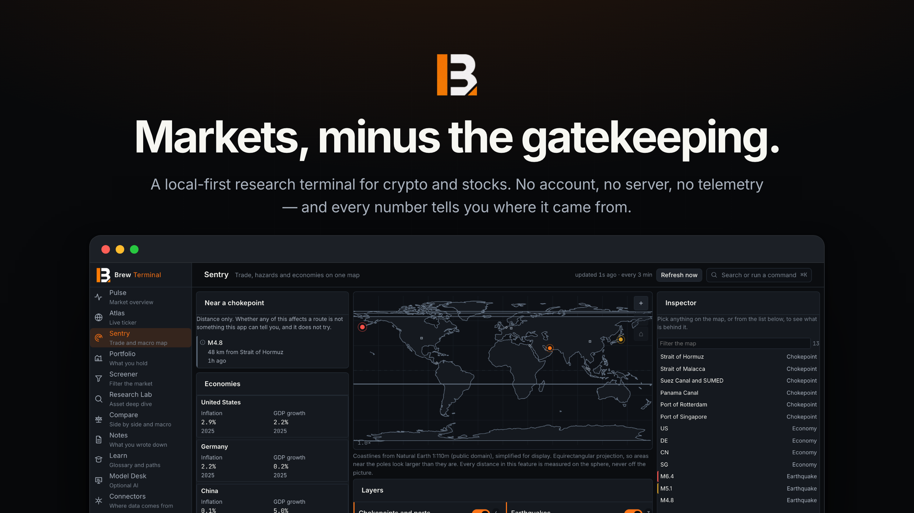

</div>

## The one idea

Most finance apps show you a number. Brew Terminal shows you a number, who produced it, and how
long ago — every time, on every screen, because the type system does not offer a way to skip it.

<div align="center">

<picture>
  <source media="(prefers-color-scheme: dark)" srcset="docs/diagrams/provenance-dark.svg">
  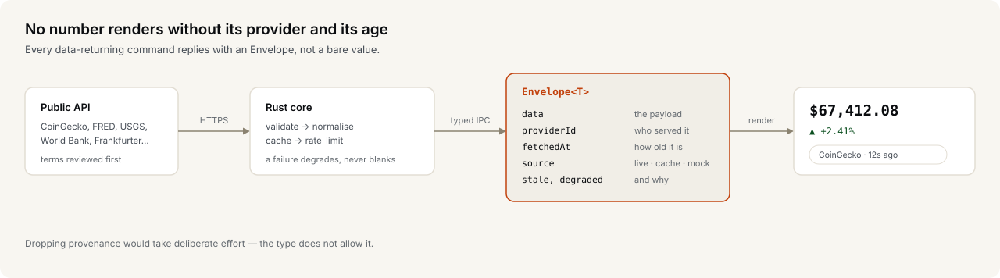
</picture>

</div>

That one constraint decides most of what this app is. A provider that fails degrades to older
data with the reason attached, instead of an empty panel. A figure the app computed itself shows
its inputs and its arithmetic. A source whose terms nobody has read is labelled as exactly that,
rather than quietly used.

## ☕ What you get

|                                 |                                                                                                                                                                |
| ------------------------------- | -------------------------------------------------------------------------------------------------------------------------------------------------------------- |
| **Local-first**                 | No sign-up, no server, no cloud sync. Watchlists, notes and preferences live in one SQLite file on your computer.                                              |
| **No telemetry**                | The app makes no request you did not cause — with one exception, stated plainly: price alerts poll in the background, and they are off until you enable them.  |
| **Honest about data**           | Every number carries its provider and its age. Nothing is presented as fresher, or more certain, than it is.                                                   |
| **Optional AI, off by default** | Bring a local model or your own API key, or use none. Before anything is sent you get an itemised list of what goes with it, and every send is logged locally. |
| **Learn works offline**         | A 50-term glossary and five learning paths ship with the app. Reading any of it makes no request.                                                              |
| **Portable**                    | An encrypted `.brewprofile` moves your watchlists, notes, progress and settings to another machine. It contains no API keys.                                   |
| **Cross-platform**              | macOS, Windows and Linux, built to stay responsive on a 2016 Intel MacBook.                                                                                    |

## 🖥 The twelve screens

<div align="center">

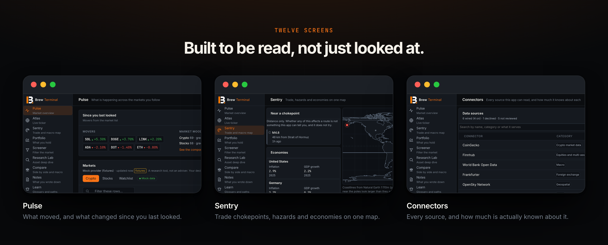

</div>

<div align="center">

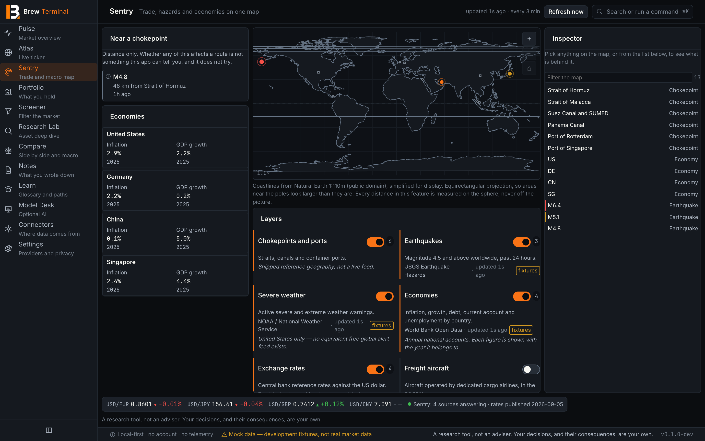

<sub>**Sentry** — trade chokepoints, hazards and economies on one map. Every layer names its source, its age, and where its coverage stops.</sub>

</div>

<div align="center">

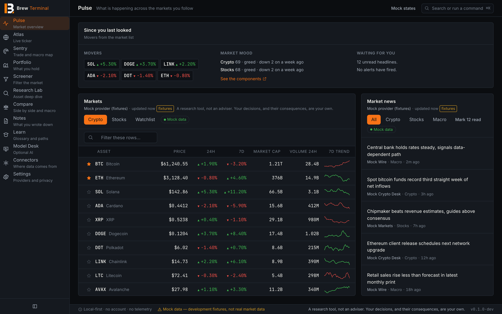

<sub>**Pulse** — what moved, what you follow, what is worth reading. The digest summarises what changed since you last looked.</sub>

</div>

<!-- Laid out by hand. Prettier pads every cell to the width of the widest one, and these
     captions are long enough that doing so turns each row into a single ~300-character
     line. The rendered table is identical either way; only the source becomes unreadable. -->
<!-- prettier-ignore -->
| | |
| --- | --- |
| 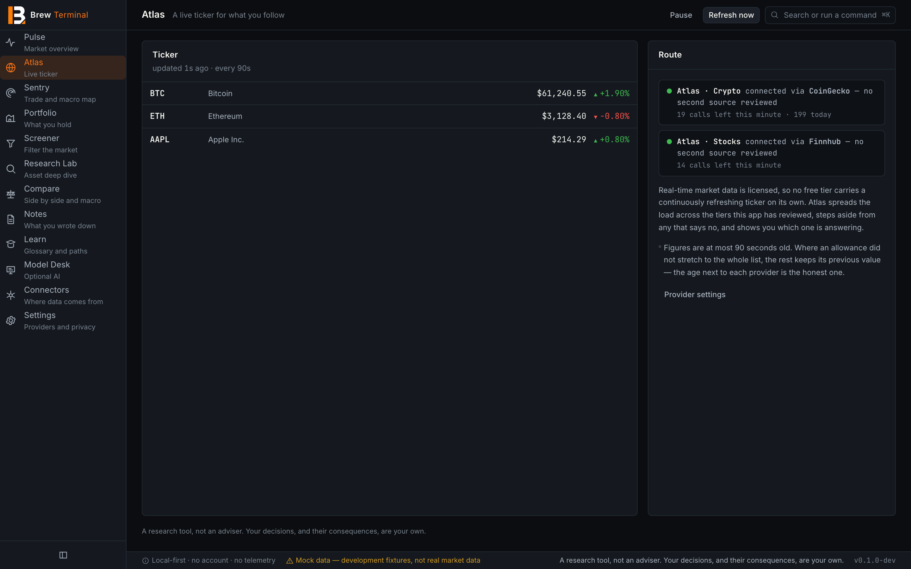 | 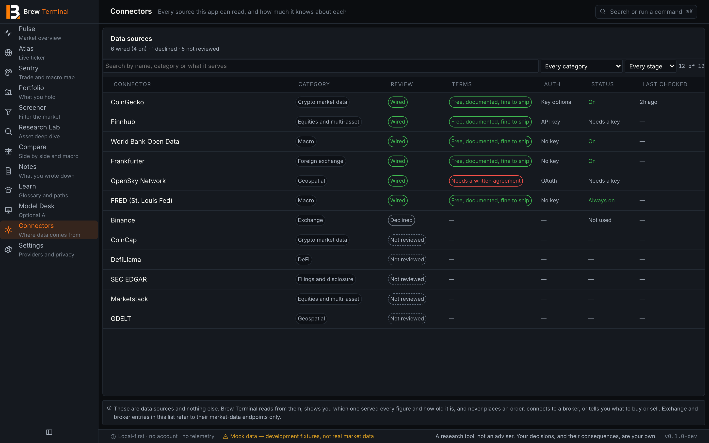 |
| **Atlas.** A ticker over free provider tiers, refreshing every 90 seconds. Real-time market data is licensed, so no free tier carries a continuous feed — Atlas says "at most 90 seconds old" rather than "live", and shows which tier is answering and how much of its allowance is left. | **Connectors.** Every source this project has wired, declined, or merely written down. Roughly ninety rows are visibly empty, because nobody has read those providers' terms — and a plausible-looking rate limit beside a name would be a claim this project cannot make. |
| 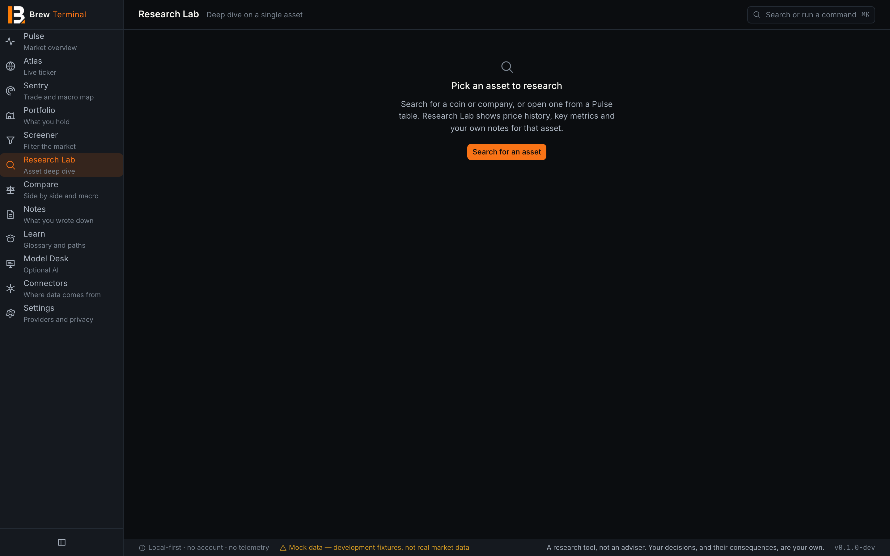 | 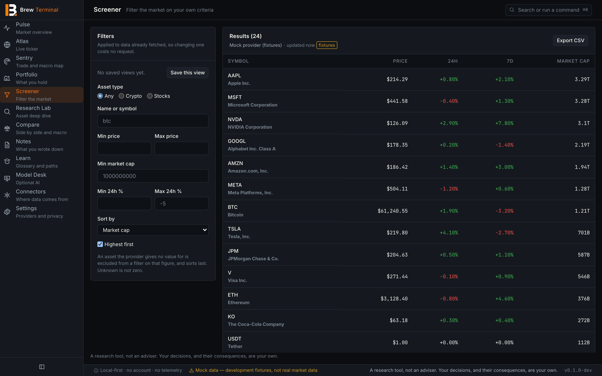 |
| **Research Lab.** One asset in depth: chart, indicators, news and your own notes on it, with a risk checklist that has no checkboxes and no tally — [by design](docs/DECISIONS.md). | **Screener.** Filters on reported facts — price, change, market cap, volume. No score, no ranking, no "opportunities". |
| 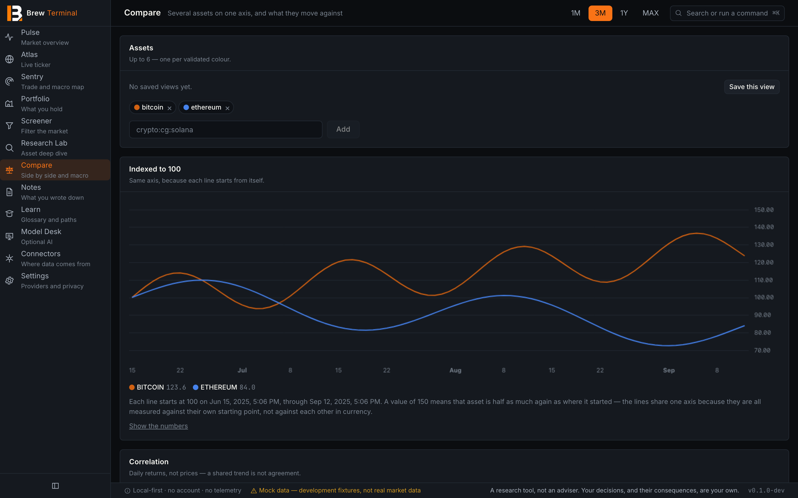 | 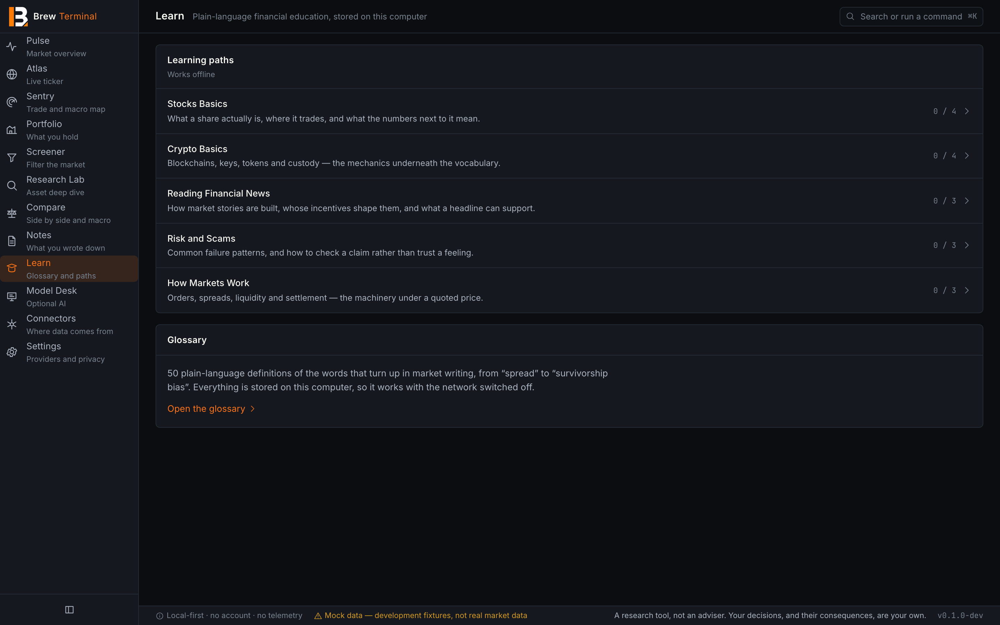 |
| **Compare.** Up to six assets and macro series on one axis, normalised or absolute, with a correlation matrix that says plainly what correlation is not. | **Learn.** A glossary and five paths, written for someone who has never read a balance sheet. Ships with the app; reading it makes no request. |
| 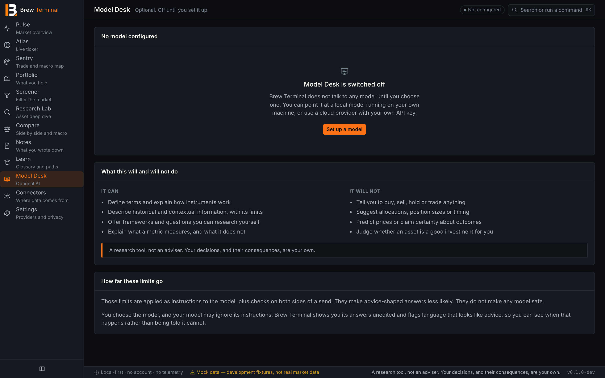 | 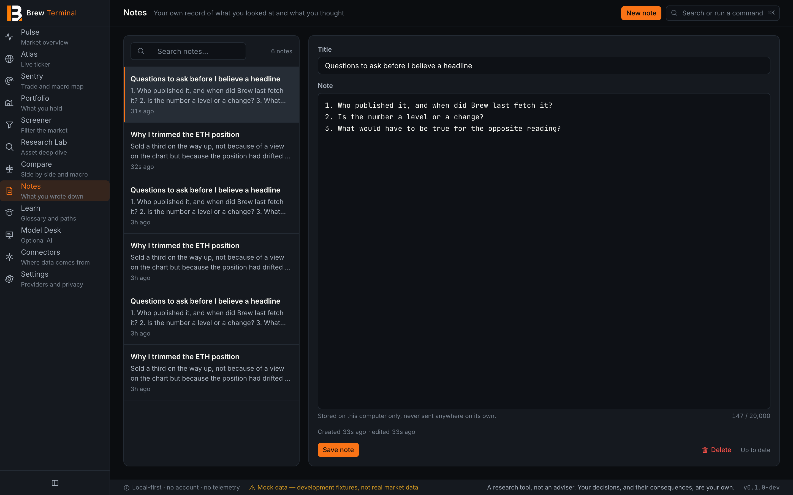 |
| **Model Desk.** Optional AI. Local or your own endpoint, off until you configure it. You see exactly what would be sent before it is sent, and the answer is shown unedited with advice-shaped language flagged. | **Notes.** A local research journal with full-text search, pinned to dates on the chart. Notes never leave the machine on their own; attaching one to a prompt is a separate, explicit action. |

Also here: **Portfolio**, where positions are derived by replaying the transactions that produced
them rather than stored, so cost basis and position can only ever agree — and **Settings**, which
holds every provider, key and privacy control in one place.

> Screenshots are from a development build, which is why panels carry a `fixtures` badge and the
> status bar says so. That labelling is the app working correctly: mock data is never allowed to
> look like the real thing.

## 🔧 How it is built

<div align="center">

<picture>
  <source media="(prefers-color-scheme: dark)" srcset="docs/diagrams/architecture-dark.svg">
  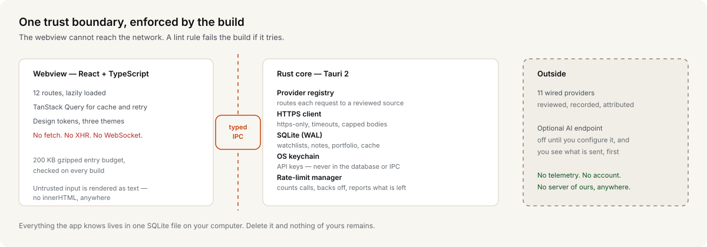
</picture>

</div>

The webview cannot reach the network — not by convention, but because a lint rule fails the build
if `fetch` appears in frontend code. Every outbound request, every credential and every byte of
stored data lives on the Rust side of a typed IPC boundary.

<details>
<summary><b>The numbers, if you like numbers</b></summary>

<br>

|                               |                                                               |
| ----------------------------- | ------------------------------------------------------------- |
| Rust tests                    | 684                                                           |
| Frontend tests                | 599                                                           |
| Architecture decision records | 41, each with what was rejected and why                       |
| Schema migrations             | 10, forward-only                                              |
| Initial JS bundle             | 98 KB gzipped, against a 200 KB budget checked on every build |
| Wired data providers          | 11                                                            |

Every gate CI runs is one command locally: `npm run verify`.

</details>

## 🔌 Where the data comes from

Eleven providers are wired, and each one's terms, rate limits and attribution were read and
recorded in [`docs/PROVIDERS.md`](docs/PROVIDERS.md) **before** any code was written against it.

| Provider                                                              | Serves                             | Key          |
| --------------------------------------------------------------------- | ---------------------------------- | ------------ |
| [CoinGecko](https://www.coingecko.com/en/api)                         | Crypto prices, market caps, charts | optional     |
| [Finnhub](https://finnhub.io/docs/api)                                | Equity quotes, profiles, news      | free key     |
| [Alpha Vantage](https://www.alphavantage.co/documentation/)           | Equity chart history               | free key     |
| [FRED](https://fred.stlouisfed.org/docs/api/fred/)                    | US macro series                    | none         |
| [Alternative.me](https://alternative.me/crypto/fear-and-greed-index/) | Crypto Fear & Greed index          | none         |
| RSS / Atom                                                            | Headlines from feeds you choose    | none         |
| [World Bank](https://data.worldbank.org)                              | Country indicators                 | none         |
| [Frankfurter](https://frankfurter.dev)                                | Central bank reference rates       | none         |
| [USGS](https://earthquake.usgs.gov)                                   | Worldwide earthquakes              | none         |
| [NOAA / NWS](https://www.weather.gov/documentation/services-web-api)  | US severe weather warnings         | none         |
| [OpenSky](https://openskynetwork.github.io/opensky-api/rest.html)     | Freight aircraft positions         | **your own** |

OpenSky ships **switched off**, and not because of price: its licence covers non-profit research
and education, and using the API from a distributed application needs a prior written agreement.
That restriction is on the toggle, not buried in a footnote.

The in-app **Connectors** screen lists these alongside every source that was reviewed and
declined — with the reason — and around ninety more that nobody has looked at yet. Those carry no
rate limit, no licence and no risk badge, because this project has not earned the right to state
one. See [`docs/CONNECTORS.md`](docs/CONNECTORS.md).

**No scraping. No undocumented endpoints. No reverse-engineered APIs.** Including the ones that
would work — [ADR-008](docs/DECISIONS.md) treats that as a question about this project's standing
rather than a technical one.

## 🚫 What this is not

Not a broker. Not a financial adviser. It will not tell you what to buy, when to sell, where a
price is going, or whether something is a good investment. Those are not missing features — they
are deliberate exclusions, documented in
[`docs/PRODUCT_SCOPE_V0_1.md`](docs/PRODUCT_SCOPE_V0_1.md) and the decision log.

It does keep a record of what you hold, typed in by you, so it can show cost basis and what a
position has actually done. It connects to no broker, sees no account, and places no orders.

There is no scam score, no legitimacy verdict, no "trending", and no ranking of anyone's opinions
— aggregating opinion into a number is a judgement this project has no basis for. The two Fear &
Greed indices are a different thing: they describe _market conditions_ from published
measurements, they attach to no individual asset, and the one this app computes shows every
component with its source series and arithmetic, so it can be checked rather than believed. Where
that line falls, and why, is [ADR-037](docs/DECISIONS.md).

## Status

**v0.4.0.** Everything described here is built and covered by tests. What that does not mean is
"proven in the wild":

- **The app is unsigned.** A locally built bundle opens fine; a downloaded one is blocked until you follow the step below.
- **No AI request has been made against a live endpoint.** The request path is covered by unit tests, a guardrail suite and a browser harness — not by a real answer from a real model.
- **No live community provider is wired in.** The pipeline is complete and opt-in, but the only adapter that ships is a fixture one, because no discussion platform's terms have been read.
- **Guardrails reduce risk; they do not eliminate it.** You choose the model, and your model may ignore its instructions. The app shows answers unedited and flags advice-shaped language so you can see when that happens, rather than claiming it cannot.

Crypto prices and history come from CoinGecko and need no key. Equities need a free Finnhub key,
added in Settings → Data providers; until then the Stocks tab says so rather than showing
anything. Development builds also enable a fixture provider so the UI can be worked on offline —
anything it serves is labelled "Mock data" in the panel and in the status bar.

## ⬇️ Download

Installers for all three platforms are attached to each
[release](https://github.com/KleivinX/Brew-Terminal/releases): a `.dmg` for macOS, `.msi` or
`.exe` for Windows, and `.AppImage` or `.deb` for Linux.

The app is **not code-signed**, so the first launch needs one extra step:

- **macOS** — right-click the app and choose **Open**, then **Open** again. Double-clicking will not offer the option.
- **Windows** — SmartScreen shows "Windows protected your PC". Click **More info** → **Run anyway**.
- **Linux** — `chmod +x` the AppImage before running it.

That warning is expected. Signing needs a paid Apple Developer ID and a Windows code-signing
certificate; until those exist, every unsigned build behaves this way.

## 🚀 Build from source

Requires [Node.js](https://nodejs.org) 20.19+ and a [Rust toolchain](https://rustup.rs). Tauri
also needs platform build tools — see the
[Tauri prerequisites](https://tauri.app/start/prerequisites/).

```bash
npm install
npm run tauri:dev
```

Or run the UI in a plain browser against the same fixtures — a much faster loop, and it needs no
Rust rebuild:

```bash
npm run dev
```

Build a release bundle (`.dmg`, `.msi`, `.AppImage`, depending on your platform):

```bash
npm run tauri:build
```

Run every gate CI runs, in CI's order:

```bash
npm run verify
```

## ⌨️ Keyboard

| Keys                | Action                                                                                                                                                                    |
| ------------------- | ------------------------------------------------------------------------------------------------------------------------------------------------------------------------- |
| `⌘K` / `Ctrl+K`     | Command palette                                                                                                                                                           |
| `g` then a letter   | Jump to a screen — `p` Pulse, `a` Atlas, `m` Sentry, `o` Portfolio, `e` Screener, `r` Research, `c` Compare, `n` Notes, `l` Learn, `d` Desk, `k` Connectors, `s` Settings |
| `⌘1`–`⌘9`           | Jump to the first nine screens in rail order                                                                                                                              |
| `⌘R` / `Ctrl+R`     | Refresh visible data                                                                                                                                                      |
| `j` / `k` or arrows | Move table selection                                                                                                                                                      |
| `Enter`             | Open the selected asset                                                                                                                                                   |
| `Esc`               | Close an overlay                                                                                                                                                          |

## 🔐 How your data is handled

- **Watchlists, notes, preferences, learning progress** — a SQLite file in your OS application data directory. Not encrypted; see [`docs/THREAT_MODEL.md`](docs/THREAT_MODEL.md) §5 for why that is a deliberate, stated choice rather than an oversight.
- **API keys** — your operating system's credential store (macOS Keychain, Windows Credential Manager, Linux Secret Service). Never in the database, never in logs, never in exports.
- **AI** — disabled until you configure it. A model on `127.0.0.1` sends nothing off your machine, and the app only says "Local · offline" when the address actually resolves to this computer. A hosted model must use `https://` and carries your own key. Either way, nothing is sent without a direct action from you, you see exactly what would be transmitted first, and every send is recorded in a local log you can read and clear.
- **Profile exports** — encrypted with Argon2id and XChaCha20-Poly1305 using a password you choose, with a 12-character minimum. A forgotten password cannot be recovered by anyone, including this project. The file contains no credential material.

## 📖 Documentation

| Document                                            | What it covers                                             |
| --------------------------------------------------- | ---------------------------------------------------------- |
| [ARCHITECTURE.md](docs/ARCHITECTURE.md)             | Process model, IPC, caching, performance budget            |
| [PRODUCT_SCOPE_V0_1.md](docs/PRODUCT_SCOPE_V0_1.md) | Features, non-goals, acceptance criteria                   |
| [DECISIONS.md](docs/DECISIONS.md)                   | 41 ADRs — what was chosen, and what was rejected           |
| [CONNECTORS.md](docs/CONNECTORS.md)                 | The connector catalogue, feature mapping and caching rules |
| [PROVIDERS.md](docs/PROVIDERS.md)                   | Verified terms, rate limits and API quirks, per provider   |
| [DATA_MODEL.md](docs/DATA_MODEL.md)                 | SQLite schema and migration strategy                       |
| [THREAT_MODEL.md](docs/THREAT_MODEL.md)             | Keys, local data, exports, cloud AI, untrusted content     |
| [AI_POLICY.md](docs/AI_POLICY.md)                   | Guardrails and the system prompt                           |
| [UI_MAP.md](docs/UI_MAP.md)                         | Routes, keyboard map, panel states, design tokens          |
| [DEPENDENCIES.md](docs/DEPENDENCIES.md)             | Every dependency, with a reason                            |
| [PERFORMANCE.md](docs/PERFORMANCE.md)               | Measured startup, bundle and memory figures                |

## Licence and name

The code is licensed under **AGPL-3.0-or-later** — see [LICENSE](LICENSE).

The **Brew Terminal name, logo and artwork are not covered by that licence**. You may fork the
code, but a fork must use a different name and must not present itself as official. See
[TRADEMARK.md](TRADEMARK.md).

## Contributing

See [CONTRIBUTING.md](CONTRIBUTING.md). Security issues: [SECURITY.md](SECURITY.md).

## Credits

Made with love by **Kleivin** &amp; **Blocks and Brew**.

|                       |                                                                                                                                                              |
| --------------------- | ------------------------------------------------------------------------------------------------------------------------------------------------------------ |
| **Kleivin Gjuzi**     | [GitHub](https://github.com/KleivinX) · [LinkedIn](https://www.linkedin.com/in/kleivin-gjuzi-7a7w/)                                                          |
| **Blocks &amp; Brew** | [blocksandbrew.com](https://blocksandbrew.com) · [LinkedIn](https://www.linkedin.com/company/blocks-brew) · [Instagram](https://instagram.com/blocksandbrew) |

---

<div align="center">


### ⚠️ Disclaimer

</div>

**Brew Terminal is a research tool. It is not financial advice, and we are not responsible for
what you do with it.**

Nothing this app displays is financial, investment, legal or tax advice, and nothing in it is a
recommendation to buy, sell or hold anything. It places no orders and connects to no broker.

Market data comes from third-party providers and may be **delayed, incomplete or simply wrong**.
The app tells you which provider served each figure and how old it is precisely so you can check
it — verify anything that matters against a primary source before acting on it.

Any decision you make is yours, and so is any loss. The authors and contributors accept no
liability for anything that follows from using this software. It is provided "as is", without
warranty of any kind, as set out in the [AGPL-3.0 licence](LICENSE).
