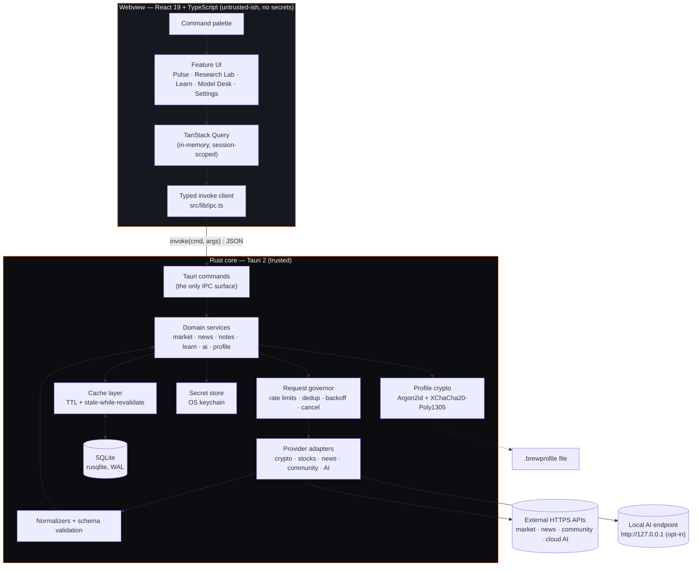

# Brew Terminal — Architecture

Status: Phase 0 proposal. Not yet implemented.
Target platforms: macOS 10.15+, Windows 10+, Linux (glibc, WebKitGTK 4.1).
Reference hardware: 2016 Intel MacBook (dual-core, 8 GB RAM, macOS 13).

---

## 1. Guiding constraints

Every architectural choice below is driven by four constraints, in priority order:

1. **Local-first and account-free.** No server component exists. If the network is gone, the app still opens, still shows cached data, and Learn still works entirely.
2. **Old hardware is the target, not the edge case.** A dual-core 2016 Intel machine is the performance budget. Work that is invisible to the user should not run.
3. **Secrets never enter the webview.** API keys live in the OS keychain and are used only inside the Rust process.
4. **Untrusted input by default.** Every provider response, every cached row, every import file is validated before it reaches the UI.

---

## 2. Process and trust model

Brew Terminal is a two-tier application inside a single OS process tree.



### 2.1 Why all network I/O lives in Rust

The webview makes **zero** outbound requests. `tauri.conf.json` ships a CSP with
`connect-src 'self' ipc: http://ipc.localhost` and `default-src 'self'`. Consequences:

- **API keys never cross the IPC boundary.** The frontend can ask for "quotes for these 12 assets"; it can never read the key that made the call. A future XSS in a news-article renderer therefore cannot exfiltrate credentials.
- **No CORS problems.** Many market APIs do not send permissive CORS headers. Fetching from Rust sidesteps the class of problem entirely.
- **One place for the governor.** Rate limiting, deduplication, backoff and caching are implemented once, in one language, and apply to every caller including background refresh.
- **Cancellation is real.** A dropped `tokio` task cancels the socket; an abandoned `fetch` in a webview often does not.

### 2.2 Command / service split

`#[tauri::command]` handlers are thin: they unwrap `tauri::State` and delegate to a function in
`src-tauri/src/services/` that takes `&AppState`. The logic lives in the service layer so it is
reachable from an integration test without a Tauri runtime — see ADR-016. `tests/app_flow.rs`
drives the real path (provider → validate → cache → SQLite → envelope) against a real database
file, which is how "your watchlist survives a restart" is verified rather than asserted.

### 2.3 IPC surface

The frontend never sends SQL and never sends a URL. Commands are verb-shaped and typed:

```
market: search_assets, get_quotes, get_chart, get_asset_profile
watchlist: list_watchlists, create_watchlist, add_item, remove_item, reorder_items
news: get_news
community: get_asset_discussions
notes: list_notes, upsert_note, delete_note
learn: list_content, get_entry, set_progress
ai: list_ai_providers, get_ai_status, ai_chat, list_conversations, delete_conversation
settings: get_preferences, set_preference, list_providers, set_provider_enabled,
          save_provider_credential, delete_provider_credential, test_provider
profile: export_profile, inspect_profile, import_profile
cache: get_cache_stats, clear_cache
```

Every data-returning command replies with a freshness envelope rather than a bare payload:

```ts
type Envelope<T> = {
  data: T;
  meta: {
    providerId: string;
    providerName: string; // for on-screen attribution
    fetchedAt: string; // ISO 8601 UTC
    source: 'live' | 'cache' | 'mock';
    stale: boolean; // past TTL but still shown
    degraded?: {
      // set when live refresh failed
      reason: 'rate_limited' | 'network' | 'provider_error' | 'not_configured';
      retryAfter?: string;
      message: string; // user-safe; never contains a key or raw URL
    };
  };
};
```

This is the mechanism behind the brief's "never silently fail a provider request": the UI
cannot render a number without also having the provider, the timestamp, and the degraded
state in hand. Attribution and staleness are structurally impossible to forget.

---

## 3. Frontend architecture

### 3.1 Layers

```
src/app/          Shell, router, theme provider, error boundaries, command palette host
src/features/*    Feature slices — each owns its routes, components, hooks, queries, types
src/components/   Cross-feature primitives (Button, Table, Card, Sparkline, StatusPill…)
src/lib/          ipc client, formatters, query client config, keyboard registry
src/providers/    Frontend-side provider *metadata* only (display names, doc links, icons)
src/stores/       Zustand stores for ephemeral UI state
src/styles/       Design tokens + global CSS
src/types/        Shared domain types, generated to match Rust models
```

A feature slice may import from `components/`, `lib/`, `stores/`, `types/`. A feature slice
may **not** import from another feature slice; shared code moves down into `components/` or
`lib/`. This is enforced by an ESLint `no-restricted-imports` rule, not by convention alone.

### 3.2 State ownership

Three kinds of state, three homes, no overlap:

| Kind                 | Home                                             | Example                                |
| -------------------- | ------------------------------------------------ | -------------------------------------- |
| Server/provider data | TanStack Query (memory) over SQLite (durable)    | quotes, charts, news                   |
| Durable user data    | SQLite via commands, read through TanStack Query | watchlists, notes, progress            |
| Ephemeral UI         | Zustand                                          | palette open, selected tab, table sort |

Theme is the one deliberate exception: it is persisted in SQLite _and_ mirrored to
`localStorage` so the correct theme paints on first frame without waiting for IPC.

### 3.3 Type parity with Rust

Rust domain models are the source of truth. `ts-rs` derives TypeScript declarations from the
Rust structs into `src/types/generated/`, and CI fails if the checked-in output differs from a
fresh generation. This removes the usual hand-maintained drift between `Quote` in Rust and
`Quote` in TypeScript without adding a runtime dependency.

---

## 4. Data freshness and caching

Two tiers, with SQLite as the durable one.

```
UI ──ask──> TanStack Query ──miss/stale──> invoke ──> Rust cache ──miss/stale──> provider
                  │                                       │                        │
              instant re-render                  returns cached row +          writes row,
              from memory                        schedules revalidate          returns fresh
```

Rules:

- **Read-through, stale-while-revalidate.** A cache hit past its TTL is returned immediately with `stale: true`, and a single revalidation is scheduled. The UI shows the old number with a staleness marker rather than a spinner over an empty panel.
- **TTL by data class**, configurable, conservative by default:
  | Data                  | Default TTL | Rationale                                            |
  | --------------------- | ----------- | ---------------------------------------------------- |
  | Quotes (visible rows) | 60 s        | Fast enough to feel live, slow enough for free tiers |
  | Charts 1D             | 5 min       | Intraday shape does not change per second            |
  | Charts 1W–max         | 6 h         | Historical series are effectively immutable          |
  | Asset profile         | 7 d         | Descriptions change rarely                           |
  | News                  | 10 min      |                                                      |
  | Community             | 30 min      | Explicitly not real-time                             |
- **Batching is mandatory.** `get_quotes` takes a vector of identifiers. There is no single-quote command, so a per-row fetch cannot be written by accident.
- **Only visible rows refresh.** The table reports its visible identifier window; the refresh loop is fed from that window, not from the full watchlist.
- **Focus-aware.** On window blur, refresh intervals multiply by 4. After 5 minutes unfocused, background refresh stops entirely and resumes on focus with one immediate revalidation.
- **Single-flight.** The governor keys in-flight requests by `(provider, endpoint, normalized args)`. Concurrent callers await the same future.
- **Backoff.** Failures back off exponentially per provider (1 s → 2 s → 4 s … capped at 5 min) with full jitter. A `429` with `Retry-After` sets a hard gate for that provider, and the UI shows a rate-limit state instead of retrying into the wall.

---

## 5. Performance budget

These are targets to measure against on the reference 2016 Intel MacBook, not guarantees.
`docs/PERFORMANCE.md` will hold the measured numbers once Phase 1 lands.

| Metric                                  | Budget                                        |
| --------------------------------------- | --------------------------------------------- |
| Cold start to interactive shell         | ≤ 2.0 s                                       |
| Warm start                              | ≤ 1.2 s                                       |
| Route switch (cached data)              | ≤ 150 ms                                      |
| Idle RSS, Pulse open, 25-row watchlist  | ≤ 300 MB total across app + webview processes |
| Idle CPU, focused, no refresh in flight | < 1 %                                         |
| Initial JS bundle, gzipped              | ≤ 200 KB                                      |
| Any lazy route chunk, gzipped           | ≤ 120 KB                                      |
| Installer size                          | ≤ 15 MB                                       |

Techniques used to hold them:

- Route-level `React.lazy` for Research Lab, Learn, Model Desk, Settings. Pulse is in the initial chunk.
- The chart library is imported only inside the Research Lab chunk, never on the dashboard.
- Long tables virtualize above 40 rows (`@tanstack/react-virtual`).
- Sparklines are a single hand-written `<path>` over ≤ 24 downsampled points — roughly 20 DOM nodes for a visible viewport, not hundreds.
- No always-on timers. One coalesced refresh scheduler, cancellable, focus-aware.
- `prefers-reduced-motion` is respected globally; transitions are limited to opacity/transform and capped at 150 ms.

---

## 6. Styling: CSS Modules + token layer (chosen over Tailwind)

**Decision:** CSS Modules with a CSS custom-property token layer. See `DECISIONS.md` ADR-004.

Justification against the brief's requirements:

- **Three themes, one attribute.** Tokens are declared on `:root` and overridden under `[data-theme="light"]` / `[data-theme="soft"]`. Switching themes flips one attribute; no class-name duplication, no per-component variant matrices, no flash of restyled content.
- **No extra build step.** Vite handles `*.module.css` natively. On a dual-core machine this removes a PostCSS/JIT watcher from every keystroke during development, which is a real quality-of-life difference on the reference hardware.
- **Smaller, more predictable CSS.** Output is bounded by what components actually declare, and dead CSS is caught per-module rather than by a content-scanning purge step.
- **Zero runtime.** No styled-components/emotion runtime cost at mount.

Accepted trade-off: more hand-written CSS and less community muscle memory than Tailwind.
Mitigated by a small, documented token set and a `components/` primitive layer that most
feature code composes rather than restyles.

---

## 7. Provider adapter layer

No UI component knows that CoinGecko exists. The chain is:

```
Command → Service → Governor → Adapter (provider-specific HTTP) → Validator → Normalizer → domain model
```

Each adapter declares capabilities, and the UI hides or disables what a provider cannot do:

```rust
pub struct ProviderCapabilities {
    pub asset_types: Vec<AssetType>,      // crypto | stock | etf | index
    pub search: bool,
    pub quotes: bool,
    pub charts: Vec<ChartRange>,          // only ranges actually supported
    pub profiles: bool,
    pub requires_credential: bool,
    pub attribution: Attribution,         // required text + link, rendered by the UI
    pub rate_limit: RateLimitPolicy,
}
```

Validation happens before normalization: `serde` deserialization into a provider-specific DTO,
then explicit range checks (finite numbers, sane timestamps, non-empty symbols, currency codes)
before mapping into the app-level model. A malformed field fails that record, not the request —
one bad row does not blank the table.

**Mock-first.** `MockMarketProvider` and `MockNewsProvider` read deterministic fixtures from
`content/fixtures/` and can simulate latency, rate limits, partial failure and empty results via
a dev-only settings panel. Every state in the UI — loading, empty, stale, rate-limited,
provider-error, not-configured — is reachable without a network connection.

Fixtures are **never the default in a release build**: the mock provider is seeded enabled only
under `debug_assertions`, so an unconfigured release shows "no provider set up yet" rather than
plausible-looking fake prices. See ADR-018.

#### Routing across providers

No single provider covers both crypto and equities, so the registry resolves a provider _per
asset type_, keyed off the canonical id (`crypto:cg:…` → CoinGecko, `stock:us:…` → Finnhub). A
watchlist mixing both is split by owner, fetched per provider, and merged by the service layer.

Merging has three rules that exist to keep the result honest (ADR-017):

| Situation                            | What the merged envelope reports                                              |
| ------------------------------------ | ----------------------------------------------------------------------------- |
| Two providers contributed            | Both names — "CoinGecko · Finnhub". Attribution is owed to each.              |
| They were fetched at different times | The **oldest** timestamp. A panel is only as fresh as its stalest part.       |
| One contributor is a mock            | The whole panel is marked `mock`. Half-fixture data must not present as live. |
| An asset has no configured provider  | A `not_configured` degraded marker, not a silently missing row.               |

#### The batching asymmetry

CoinGecko's `/coins/markets` returns a whole watchlist plus sparklines in **one** request.
Finnhub's `/quote` takes **one symbol per call** and has no batch endpoint, so N symbols cost N
calls against a 60/minute budget. The Finnhub adapter therefore reserves budget up front, fans
out four at a time, and returns partial results with a degraded marker rather than firing a
whole watchlist at the API and collecting 429s. This asymmetry is a property of the providers,
not something the adapter layer can engineer away — recorded in `docs/PROVIDERS.md`.

All HTTP goes through `providers/http.rs`, which enforces HTTPS-only, a 15 s timeout, a 2 MB
response cap, at most three redirects, and URL redaction before anything reaches a log.

Live integration order and the terms review for each provider are in `docs/PROVIDERS.md`.

---

## 8. Local persistence

`rusqlite` with the `bundled` feature (SQLite compiled in — no reliance on the host's system
library, identical behaviour across all three platforms). Full schema in `DATA_MODEL.md`.

Connection settings: `journal_mode=WAL`, `synchronous=NORMAL`, `foreign_keys=ON`,
`busy_timeout=5000`. A small connection pool (`r2d2_sqlite`, 4 connections) sits behind the
services; blocking SQLite work runs on `tokio::task::spawn_blocking` so the async runtime is
never stalled.

Migrations are forward-only numbered SQL files embedded with `include_str!`, applied inside a
transaction, gated on `PRAGMA user_version`. The database file is copied to
`brew.db.pre-<version>.bak` before any migration runs.

Location: Tauri's `app_data_dir()` —
`~/Library/Application Support/com.brewterminal.app/` (macOS),
`%APPDATA%\com.brewterminal.app\` (Windows),
`~/.local/share/com.brewterminal.app/` (Linux, XDG-respecting).

---

## 9. Secrets and encrypted profile

- **API keys:** `keyring` crate → macOS Keychain, Windows Credential Manager, Linux Secret Service. Never in SQLite, never in config files, never in logs, never in exports. After save, only a masked form (`sk-…4f2a`) is ever returned over IPC. If no Secret Service is available on Linux, the app degrades to a session-only in-memory key with an explicit warning — it does not silently write a plaintext fallback.
- **`.brewprofile` export:** Argon2id (memory-hard KDF) → XChaCha20-Poly1305 (AEAD), both from the RustCrypto project. Versioned plaintext header carries the KDF parameters and is bound as additional authenticated data. API keys are excluded, with no opt-in to include them in v0.1. No custom cryptography is written. Full construction, parameters and open questions in `THREAT_MODEL.md` §6.

---

## 9a. Learn content pipeline

Educational content is data, not components. It lives in `content/learn/*.json`, is described
by a Zod schema, and is validated three times over — in CI, in the test suite, and again when
the module loads. See ADR-026.

```
content/learn/*.json
        │
        ├── validated in CI          (npm run build gates on the content test)
        ├── validated in the suite   (tests/safety/content.test.ts)
        └── validated at load        (features/learn/content.ts throws on a bad bundle)
                │
                └── in-memory search, no index, no request
```

The validator checks more than shape: unique ids, that every cross-reference resolves, that no
entry is a dead end, and that no string contains advice-shaped language. That last check exists
because educational copy is where explaining most easily slides into recommending.

Because the bundle is a module import rather than a fetch, **Learn works with the network
switched off**, search included — asserted by a test that fails if `fetch` is called while the
content loads. The whole Learn chunk, content and all, is ~40 KB gzipped and lazy-loaded.

## 10. AI architecture

AI is a leaf, not a dependency. Removing it entirely would break no other feature.

- **Local mode:** an OpenAI-compatible endpoint on `127.0.0.1` supplied by the user (Ollama, llama.cpp server, LM Studio and similar all expose one). Nothing is bundled. The UI labels this "Local · offline" only after the configured host resolves to a loopback address; any other host is labelled "Local endpoint · network".
- **Cloud mode:** the user's own API key via the keychain, disabled until configured. Every first send in a session shows exactly what text will leave the device, and each send is recorded in a local `ai_outbound_log` the user can read and clear.
- **Guardrails:** a versioned system prompt (`content/ai/system-prompt.md`), a pre-send client check that flags advice-shaped prompts and offers an educational reframing, and a persistent non-dismissible "Educational information only — not financial advice" label in the Model Desk. Prompt-level constraints reduce but do not eliminate unwanted output; the documentation says so plainly. Full policy in `AI_POLICY.md`.

**As built (Phase 5).** The module layout mirrors the rest of the app — thin command, all logic
in the service:

```
commands/ai.rs        13 thin wrappers
services/ai.rs        resolve → validate → assemble → log → send → persist
providers/ai.rs       endpoint parsing, loopback resolution, message assembly, chat client
db/repo_ai.rs         endpoint config, conversations, messages, outbound log
content/ai/system-prompt.md   compiled in with include_str!, prettier-ignored
```

Three properties are worth naming because they are enforced rather than intended:

- The system prompt is `include_str!`'d, so a missing file is a compile error rather than a
  request that goes out ungoverned. A test asserts it matches `AI_POLICY.md` §4 byte for byte.
- `assemble_messages` is the single source of truth for what a request contains. `preview_ai_send`
  and `send_ai_message` both call it, so the count shown to the user is the count sent (ADR-030).
- The adapter has its own HTTP client with a 180s timeout — a local model on the reference
  hardware can take minutes — and its own scheme rule (ADR-029). It does not use `providers::http`.

---

## 11. Error handling

One error enum crosses IPC:

```rust
pub enum AppError {
    NotConfigured { provider_id: String },
    RateLimited { provider_id: String, retry_after_secs: Option<u64> },
    Network { provider_id: String },
    ProviderError { provider_id: String, status: Option<u16> },
    InvalidResponse { provider_id: String, detail: String },
    Storage(String),
    Crypto(CryptoError),
    NotFound,
    Validation { field: String, detail: String },
}
```

Rules: messages crossing IPC are user-safe and never embed a credential, a full request URL
with query string, or a raw provider body. Rust-side `tracing` logs carry detail, with a
redaction layer that strips known secret values and `?apikey=`-style parameters. Each route is
wrapped in an error boundary that preserves the navigation shell, so a broken panel never takes
down the app.

---

## 12. Testing strategy

| Layer            | Tool                          | Covers                                                                                                            |
| ---------------- | ----------------------------- | ----------------------------------------------------------------------------------------------------------------- |
| Rust unit        | `cargo test`                  | normalizers, validators, TTL/staleness maths, governor/backoff, migrations, crypto round-trip, profile validation |
| Rust integration | `cargo test` + temp DB        | command handlers against a real SQLite file                                                                       |
| Frontend unit    | Vitest                        | formatters, hooks, query config, safety-copy presence                                                             |
| Component        | Vitest + Testing Library      | tables, empty/stale/error states, palette, theme switching, keyboard nav                                          |
| E2E              | WebDriver + `tauri-driver`    | watchlist persistence, search, settings, navigation                                                               |
| A11y             | `axe-core` in component tests | contrast, roles, focus order                                                                                      |

**Known constraint:** `tauri-driver` supports Linux and Windows only; there is no WebKitGTK/
WKWebView driver for macOS. E2E therefore runs in CI on Linux and Windows, and macOS coverage
comes from unit/component tests plus a browser harness that mocks `invoke`. This is a real
limitation of the tooling, stated here so nobody plans around a macOS E2E suite that cannot exist.
