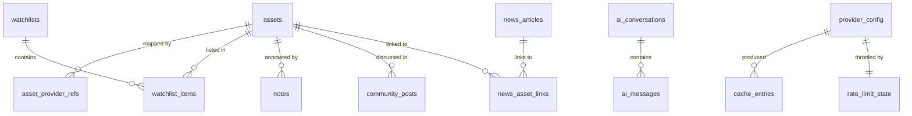

# Brew Terminal — Local Data Model

Engine: SQLite (bundled with the binary via `rusqlite`).
File: `<app_data_dir>/brew.db`, plus WAL sidecar files.
Access: Rust services only. The frontend never sends SQL.

Conventions: timestamps are integer Unix epoch **seconds, UTC**. Monetary values are stored as
`REAL` with an accompanying currency code; they are display/research figures, not ledger
entries — this app does no portfolio accounting, so decimal-exactness is not a requirement.
Text ids are stable, human-readable, lowercase.

---

## 1. Identity model

An asset has one canonical app-level id, independent of any provider:

```
<asset_type>:<namespace>:<key>
  crypto:cg:bitcoin        # crypto, CoinGecko-derived key
  stock:us:AAPL            # equity, US listing
  etf:us:VOO
  index:global:SPX
```

Provider-specific symbols hang off `asset_provider_refs`, so switching or adding a provider does
not rewrite watchlists, notes or learning progress. This is the single most important schema
decision: **user data references canonical ids, never provider ids.**

---

## 2. Schema

### 2.1 Assets

```sql
CREATE TABLE assets (
  id            TEXT PRIMARY KEY,             -- canonical id, see §1
  asset_type    TEXT NOT NULL CHECK (asset_type IN ('crypto','stock','etf','index')),
  symbol        TEXT NOT NULL,                -- display ticker, e.g. BTC, AAPL
  name          TEXT NOT NULL,
  currency      TEXT NOT NULL DEFAULT 'USD',  -- ISO 4217
  exchange      TEXT,                         -- nullable; equities only
  region        TEXT,                         -- nullable; e.g. 'us', 'eu', 'global'
  logo_cached   INTEGER NOT NULL DEFAULT 0,
  created_at    INTEGER NOT NULL,
  updated_at    INTEGER NOT NULL
);
CREATE INDEX idx_assets_symbol ON assets (symbol);
CREATE INDEX idx_assets_type_region ON assets (asset_type, region);

CREATE TABLE asset_provider_refs (
  asset_id        TEXT NOT NULL REFERENCES assets(id) ON DELETE CASCADE,
  provider_id     TEXT NOT NULL,
  provider_symbol TEXT NOT NULL,              -- what this provider calls it
  updated_at      INTEGER NOT NULL,
  PRIMARY KEY (asset_id, provider_id)
);
CREATE INDEX idx_apr_provider ON asset_provider_refs (provider_id, provider_symbol);
```

### 2.2 Watchlists

```sql
CREATE TABLE watchlists (
  id         TEXT PRIMARY KEY,
  name       TEXT NOT NULL,
  position   INTEGER NOT NULL,
  is_default INTEGER NOT NULL DEFAULT 0,
  created_at INTEGER NOT NULL,
  updated_at INTEGER NOT NULL
);

CREATE TABLE watchlist_items (
  watchlist_id TEXT NOT NULL REFERENCES watchlists(id) ON DELETE CASCADE,
  asset_id     TEXT NOT NULL REFERENCES assets(id)     ON DELETE CASCADE,
  position     INTEGER NOT NULL,
  added_at     INTEGER NOT NULL,
  PRIMARY KEY (watchlist_id, asset_id)
);
CREATE INDEX idx_wl_items_order ON watchlist_items (watchlist_id, position);
```

Reordering rewrites `position` for the affected list inside one transaction — sparse/fractional
indexing is unnecessary at watchlist scale and adds a rebalancing edge case for no gain.

### 2.3 Preferences

```sql
CREATE TABLE preferences (
  key        TEXT PRIMARY KEY,
  value      TEXT NOT NULL,   -- JSON-encoded scalar or object
  updated_at INTEGER NOT NULL
);
```

Known keys, with v0.1 defaults:

| Key                      | Default    | Notes                                                    |
| ------------------------ | ---------- | -------------------------------------------------------- |
| `theme`                  | `"dark"`   | `dark` \| `light` \| `soft`                              |
| `region`                 | `"global"` | stock discovery scope                                    |
| `display_currency`       | `"USD"`    | conversion is out of scope for v0.1; this records intent |
| `refresh_interval_secs`  | `60`       | quotes, when focused                                     |
| `refresh_when_unfocused` | `true`     | throttled ×4, stops after 5 min idle                     |
| `reduced_motion`         | `"system"` | `system` \| `always` \| `never`                          |
| `community_enabled`      | `false`    | opt-in, per the brief                                    |
| `ai_enabled`             | `false`    | opt-in                                                   |
| `ai_active_provider`     | `null`     |                                                          |
| `onboarding_completed`   | `false`    |                                                          |
| `number_format`          | `"locale"` |                                                          |

### 2.4 Provider configuration (no secrets)

```sql
CREATE TABLE provider_config (
  provider_id    TEXT PRIMARY KEY,
  kind           TEXT NOT NULL CHECK (kind IN ('market','news','community','ai')),
  enabled        INTEGER NOT NULL DEFAULT 0,
  has_credential INTEGER NOT NULL DEFAULT 0,  -- flag only; the key lives in the OS keychain
  base_url       TEXT,                        -- for self-hosted/local endpoints
  config_json    TEXT NOT NULL DEFAULT '{}',  -- non-secret options
  last_ok_at     INTEGER,
  last_error     TEXT,                        -- redacted, user-safe
  updated_at     INTEGER NOT NULL
);
```

`has_credential` is a boolean flag, never a key, never a fragment of a key.

### 2.5 Cache

```sql
CREATE TABLE cache_entries (
  cache_key    TEXT PRIMARY KEY,   -- provider:endpoint:hash(normalized args)
  provider_id  TEXT NOT NULL,
  kind         TEXT NOT NULL,      -- quote | chart | profile | news | community | search
  payload_json TEXT NOT NULL,      -- normalized app-level model, post-validation
  fetched_at   INTEGER NOT NULL,
  ttl_seconds  INTEGER NOT NULL,
  etag         TEXT,
  byte_size    INTEGER NOT NULL
);
CREATE INDEX idx_cache_kind_fetched ON cache_entries (kind, fetched_at);
CREATE INDEX idx_cache_provider ON cache_entries (provider_id);

CREATE TABLE rate_limit_state (
  provider_id          TEXT PRIMARY KEY,
  window_started_at    INTEGER NOT NULL,
  request_count        INTEGER NOT NULL DEFAULT 0,
  retry_after_until    INTEGER,
  consecutive_failures INTEGER NOT NULL DEFAULT 0,
  backoff_until        INTEGER,
  updated_at           INTEGER NOT NULL
);
```

Cache eviction: on startup and every 6 h, delete entries past `fetched_at + ttl_seconds × 10`,
then trim oldest-first if total `byte_size` exceeds a configurable cap (default 50 MB).
Settings exposes per-kind clear and a "clear all cached data" action.

### 2.6 News and community

```sql
CREATE TABLE news_articles (
  id           TEXT PRIMARY KEY,      -- hash(url)
  provider_id  TEXT NOT NULL,
  title        TEXT NOT NULL,
  url          TEXT NOT NULL UNIQUE,
  summary      TEXT,
  source_name  TEXT NOT NULL,
  category     TEXT,                  -- crypto | stocks | macro | other
  published_at INTEGER,
  fetched_at   INTEGER NOT NULL
);
CREATE INDEX idx_news_published ON news_articles (published_at DESC);

CREATE TABLE news_asset_links (
  article_id TEXT NOT NULL REFERENCES news_articles(id) ON DELETE CASCADE,
  asset_id   TEXT NOT NULL REFERENCES assets(id)        ON DELETE CASCADE,
  link_kind  TEXT NOT NULL DEFAULT 'time_adjacent'
             CHECK (link_kind IN ('provider_tagged','symbol_match','time_adjacent')),
  PRIMARY KEY (article_id, asset_id)
);

CREATE TABLE community_posts (
  id            TEXT PRIMARY KEY,
  provider_id   TEXT NOT NULL,
  asset_id      TEXT REFERENCES assets(id) ON DELETE CASCADE,
  title         TEXT NOT NULL,
  url           TEXT NOT NULL,
  author        TEXT,
  community     TEXT,                 -- e.g. subreddit name
  score         INTEGER,
  comment_count INTEGER,
  posted_at     INTEGER,
  fetched_at    INTEGER NOT NULL
);
CREATE INDEX idx_community_asset ON community_posts (asset_id, posted_at DESC);
```

`link_kind` is a safety mechanism, not bookkeeping. The "What moved this?" panel renders
`time_adjacent` articles under a heading that says these are stories published near the move,
with no causal claim. Only `provider_tagged` links are described as being about the asset.
Community rows are always rendered with an "unverified discussion" label and a source link.

### 2.7 Notes, learning, bookmarks

```sql
CREATE TABLE notes (
  id         TEXT PRIMARY KEY,
  asset_id   TEXT REFERENCES assets(id) ON DELETE CASCADE,  -- nullable: general notes
  title      TEXT NOT NULL DEFAULT '',
  body_md    TEXT NOT NULL DEFAULT '',
  created_at INTEGER NOT NULL,
  updated_at INTEGER NOT NULL
);
CREATE INDEX idx_notes_asset ON notes (asset_id, updated_at DESC);

CREATE VIRTUAL TABLE notes_fts USING fts5(
  title, body_md, content='notes', content_rowid='rowid'
);

CREATE TABLE learning_progress (
  item_id      TEXT PRIMARY KEY,   -- content id from content/learn/
  path_id      TEXT NOT NULL,
  status       TEXT NOT NULL CHECK (status IN ('not_started','in_progress','completed')),
  completed_at INTEGER,
  updated_at   INTEGER NOT NULL
);
CREATE INDEX idx_progress_path ON learning_progress (path_id, status);

CREATE TABLE bookmarks (
  kind       TEXT NOT NULL CHECK (kind IN ('glossary','lesson','article','asset')),
  ref_id     TEXT NOT NULL,
  created_at INTEGER NOT NULL,
  PRIMARY KEY (kind, ref_id)
);
```

FTS5 ships with bundled SQLite and covers note search; glossary search runs in-memory over the
local content bundle, which is small enough not to need an index.

### 2.8 AI (local only, deletable)

```sql
CREATE TABLE ai_conversations (
  id          TEXT PRIMARY KEY,
  title       TEXT NOT NULL DEFAULT 'Untitled',
  provider_id TEXT NOT NULL,
  mode        TEXT NOT NULL CHECK (mode IN ('local','cloud')),
  model_name  TEXT,
  created_at  INTEGER NOT NULL,
  updated_at  INTEGER NOT NULL
);

CREATE TABLE ai_messages (
  id              TEXT PRIMARY KEY,
  conversation_id TEXT NOT NULL REFERENCES ai_conversations(id) ON DELETE CASCADE,
  role            TEXT NOT NULL CHECK (role IN ('system','user','assistant')),
  content         TEXT NOT NULL,
  created_at      INTEGER NOT NULL
);
CREATE INDEX idx_ai_messages_conv ON ai_messages (conversation_id, created_at);

-- Transparency log: what left the device, when, to whom. Never the content.
CREATE TABLE ai_outbound_log (
  id              TEXT PRIMARY KEY,
  provider_id     TEXT NOT NULL,
  mode            TEXT NOT NULL,
  conversation_id TEXT,
  char_count      INTEGER NOT NULL,
  included_context TEXT NOT NULL DEFAULT '[]',  -- JSON: ["glossary:pe_ratio","note:<id>"]
  created_at      INTEGER NOT NULL
);
```

`ai_outbound_log` records _that_ a send happened and what kinds of context were attached, so
Settings → Privacy can show an honest history. It stores no prompt text.

### 2.9 Schema version

`PRAGMA user_version` holds the applied migration number. No separate table.

---

## 2a. Schema changes since 0001

| Migration                    | Change                                                              | Why                                                                                                                                                                                                                                                                         |
| ---------------------------- | ------------------------------------------------------------------- | --------------------------------------------------------------------------------------------------------------------------------------------------------------------------------------------------------------------------------------------------------------------------- |
| `0002_ai_prompt_version.sql` | `ai_conversations.system_prompt_version TEXT NOT NULL DEFAULT 'v1'` | AI_POLICY.md §4 requires recording which guardrail prompt a conversation was held under. Without it an old transcript cannot be read back with any confidence about what rules produced it. Existing rows predate any send, so the default is accurate rather than a guess. |

The Model Desk stores its two endpoints in the existing `provider_config` table rather than a
new one: `local-openai` and `cloud-openai`, both `kind = 'ai'`, with the address in `base_url`
and the model name in `config_json`. The `aiMode` preference selects which is active (ADR-032).
No credential is stored in either row — `has_credential` is a flag, and the key itself lives in
the OS keychain.

## 3. Migrations

- Forward-only, numbered: `src-tauri/migrations/0001_init.sql`, `0002_*.sql`, …
- Embedded with `include_str!` — no runtime file lookup, no path bugs in a bundled app.
- Applied in a single transaction per migration, gated on `PRAGMA user_version`.
- Before the first migration of a run, the DB file is copied to `brew.db.pre-<n>.bak`; the two most recent backups are kept.
- If the file's `user_version` exceeds the binary's known maximum (user downgraded the app), the app refuses to open the database and explains why rather than risking a wrong-shape write.
- Every migration gets a Rust test that runs it against a fixture DB from the previous version.

---

## 4. Entity relationships



---

## 5. What is deliberately absent

- **No holdings, cost basis, quantity, or realised/unrealised P&L.** Portfolio accounting is an explicit v0.1 non-goal, and the schema does not quietly leave a door open for it.
- **No price-alert or signal tables.** Alerts imply timing guidance.
- **No telemetry, event stream, or usage analytics.**
- **No user, account, or device table.**
- **No secret column anywhere.** Keys live in the OS keychain; the schema holds a boolean.

---

## 6. Export mapping (`.brewprofile`)

| Included                                                                | Excluded                                                  |
| ----------------------------------------------------------------------- | --------------------------------------------------------- |
| watchlists + items                                                      | API keys and any credential material                      |
| preferences (theme, region, intervals)                                  | `cache_entries` (regenerable, potentially large)          |
| notes                                                                   | `rate_limit_state`                                        |
| learning progress, bookmarks                                            | `ai_outbound_log`                                         |
| provider _config_ (enabled flags, base URLs, `has_credential` as false) | `ai_conversations` / `ai_messages` in v0.1 (opt-in later) |
| the `assets` rows referenced by the above                               |                                                           |

Import is transactional, preceded by an automatic backup of the current database, and shows a
diff-style summary — "12 watchlist items, 4 notes, 9 preferences" — with merge or replace as an
explicit user choice. Nothing is overwritten without confirmation.
